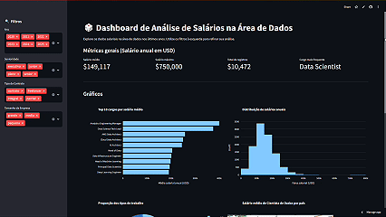

# **Análise Interativa de Dados — Streamlit**

Dashboard interativo construído com Streamlit para exploração e visualização de dados. Permite carregar datasets, visualizar tabelas, criar gráficos com Plotly e executar análises rápidas com pandas.



## Sobre

Aplicação leve em Streamlit que centraliza fluxos comuns de análise de dados:

- Carregamento de dados (CSV)
- Tratamento básico (filtros, seleção de colunas)
- Visualizações interativas com Plotly (barra, histogramas, mapas)

## Funcionalidades

- Upload e pré-visualização de datasets (CSV).
- Limpeza e filtragem interativa (seleção de colunas, filtros por valores).
- Visualizações interativas com Plotly (zoom, hover, seleção).
- Estatísticas descritivas rápidas (média, mediana, contagens).
- Download dos dados filtrados em CSV.
- Demonstração rápida
- Comandos mínimos para ver a aplicação rodando localmente:

## Instalação

### Passo a passo para clonar e rodar em ambiente local

- Clonar o repositório:

```code
    git clone https://github.com/leopinheirosilva/python.git
cd python
```

- Recomenda-se usar um ambiente virtual:

```code
python -m venv .venv

# macOS/Linux
source .venv/bin/activate

# Windows (PowerShell)
.\.venv\Scripts\Activate.ps1
```

- Instalar dependências:

`pip install -r requirements.txt`

- Rodar a aplicação no servidor local:

`streamlit run app.py`

## Contato

Email: <leonardopinheirosilva16@gmail.com>

LinkedIn: <https://www.linkedin.com/in/leonardo-pinheiro-13ba26281/>

Clique [aqui](https://dashboard-dados-py.streamlit.app/) para acessar o site!
